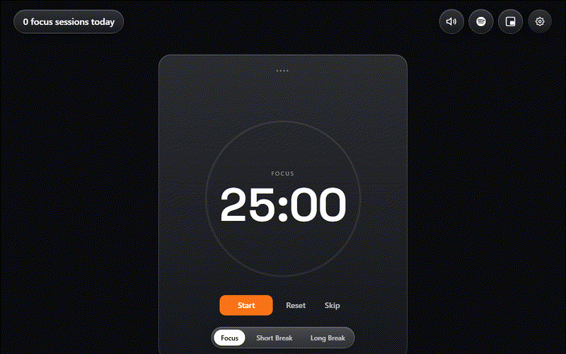

# Tetherd

A Pomodoro timer that stays out of your way — and looks like it belongs on your screen, not bolted onto it.

**[Try it live →](https://mith2021.github.io/tetherd/)** — no signup, nothing to install.



## Why

Most Pomodoro timers look like a Pomodoro timer. Tetherd is built to actually match *your* setup — custom video/image/gif backgrounds, a glassmorphic UI with an adjustable blur/transparency slider, five timer fonts, and configurable accent colors. Drag and resize every widget, save layout presets, and hide any element you don't want on screen.

## Features

- **Custom backgrounds** — upload your own image, gif, or video; reposition and adjust overlay darkness
- **Glass UI** — blur/transparency intensity is a live slider, not a fixed theme
- **Drag & resize widgets** — timer, tasks, stats — with saved layout presets
- **5 timer fonts**, configurable accent color
- **Tasks with pomodoro counts**, session tracking, stats heatmap
- **Ambient sound mixer** + YouTube/Spotify embeds that keep playing even when popovers close
- **Picture-in-Picture** timer (Chromium)
- **Keyboard shortcuts** — Space (start/pause), R (reset), S (skip)
- **Tab-away pause** + optional presence confirmation before logging a completed session
- Everything runs client-side — no account, no server, no tracking. Backgrounds are stored locally in your browser (IndexedDB).

## Tech

Vite + React 19 + TypeScript, Tailwind v4, [Base UI](https://base-ui.com) (shadcn-style components, not Radix).

## Running locally

```bash
npm install
npm run dev
```

## Deploying your own

Pushes to `master` auto-deploy to GitHub Pages via the included workflow (`.github/workflows/deploy.yml`). Fork it, update `base` in `vite.config.ts` to match your repo name, enable Pages (Settings → Pages → Source: GitHub Actions).

## Built with Claude Code

This project was built with heavy use of [Claude Code](https://claude.com/claude-code). Happy to talk through any of the implementation in issues/comments.
